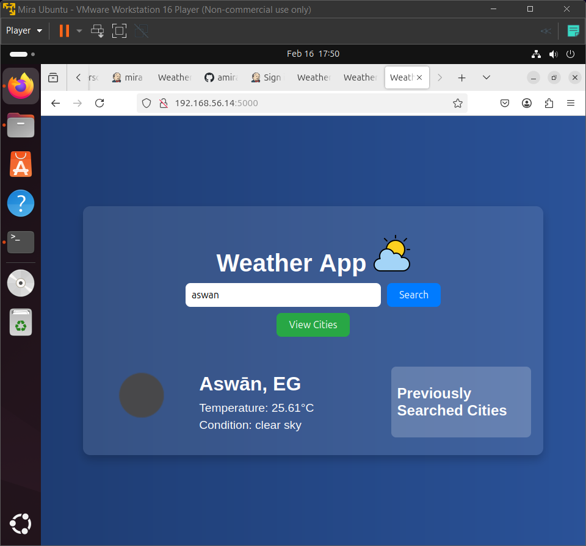
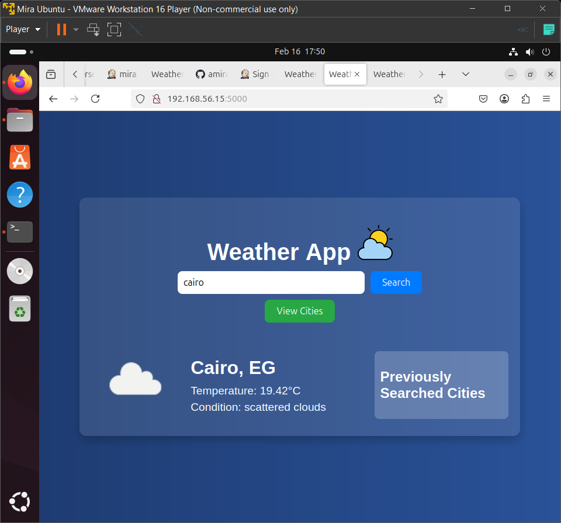

# 🌦️ WeatherApp Deployment Pipeline

This project demonstrates a **CI/CD pipeline** for deploying a Flask-based weather application using **Docker, Jenkins, and Ansible**. The application fetches weather data from the OpenWeatherMap API and stores it in a **SQLite database**.

---

## 📌 Table of Contents
1. [Project Overview](#project-overview)
2. [Prerequisites](#prerequisites)
3. [Setup Instructions](#setup-instructions)
4. [Jenkins Pipeline](#jenkins-pipeline)
5. [Ansible Deployment](#ansible-deployment)
6. [Usage](#usage)
7. [Screenshots](#screenshots)
8. [Contributing](#contributing)
9. [Acknowledgments](#acknowledgments)

---

## 🌍 Project Overview

**WeatherApp** is a simple **Flask** web application that:
- Fetches weather data using the **OpenWeatherMap API**.
- Stores the fetched data in a **SQLite database**.
- Provides **RESTful endpoints** to interact with the stored data.

### 🚀 CI/CD Pipeline Stages
1. Clone the repository from **GitHub**.
2. Build and push a **Docker image** to **Docker Hub**.
3. Deploy the application to **Vagrant-managed machines** using **Ansible**.

---

## ⚙️ Prerequisites

Ensure you have the following installed:
- **Git**: For version control.
- **Docker**: To containerize the application.
- **Vagrant & VirtualBox**: To create virtual machines for deployment.
- **Ansible**: For automating the deployment process.
- **Jenkins**: To manage the CI/CD pipeline.

Additionally, you will need:
- A **GitHub repository**.
- A **Docker Hub account**.
- An **OpenWeatherMap API key**.

---

## 🛠️ Setup Instructions

### 1️⃣ Clone the Repository
```bash
git clone https://github.com/amiraelkazzaz/WeatherApp.git
cd WeatherApp
```

### 2️⃣ Install Dependencies
```bash
pip install -r requirements.txt
```

### 3️⃣ Configure OpenWeatherMap API Key
Replace the placeholder `your_openweathermap_api_key` in **app.py**:
```python
API_KEY = "your_openweathermap_api_key"
```

### 4️⃣ Build and Push Docker Image
```bash
docker build -t weather-app .
docker tag weather-app your-dockerhub-username/weather-app:v1
docker push your-dockerhub-username/weather-app:v1
```

---

## 🔧 Jenkins Pipeline

### 1️⃣ Install Jenkins and Required Plugins
Install **Jenkins** on your machine:
```bash
sudo apt update
sudo apt install openjdk-11-jdk -y
wget -q -O - https://pkg.jenkins.io/debian-stable/jenkins.io.key | sudo tee /usr/share/keyrings/jenkins-keyring.asc > /dev/null
echo deb [signed-by=/usr/share/keyrings/jenkins-keyring.asc] https://pkg.jenkins.io/debian-stable binary/ | sudo tee /etc/apt/sources.list.d/jenkins.list > /dev/null
sudo apt update
sudo apt install jenkins -y
```
Start and enable Jenkins:
```bash
sudo systemctl start jenkins
sudo systemctl enable jenkins
```
Access **Jenkins** via:  
🔗 `http://localhost:8080`

**Install Plugins** from "Manage Jenkins" > "Manage Plugins":
- Git Plugin
- Docker Pipeline
- Ansible Plugin
- Pipeline Plugin

---

### 2️⃣ Configure Jenkins Pipeline

- Create a **new pipeline job** in Jenkins.
- Set it to **Pipeline Script from SCM**.
- Use the repository URL and set the branch.

#### 📜 Example `Jenkinsfile`
```groovy
pipeline {
    agent any

    environment {
        DOCKER_IMAGE = "your-dockerhub-username/weather-app"
    }

    stages {
        stage('Clone Repository') {
            steps {
                git branch: 'main', url: 'https://github.com/amiraelkazzaz/WeatherApp.git'
            }
        }

        stage('Build Docker Image') {
            steps {
                sh "docker build -t ${DOCKER_IMAGE}:$BUILD_ID ."
            }
        }

        stage('Push Docker Image to Docker Hub') {
            steps {
                withDockerRegistry(credentialsId: 'docker-hub-credentials') {
                    sh "docker push ${DOCKER_IMAGE}:$BUILD_ID"
                }
            }
        }

        stage('Deploy with Ansible') {
            steps {
                script {
                    sh "chmod 600 ./ansible/private_key_m01"
                    sh "export ANSIBLE_HOST_KEY_CHECKING=False"
                    sh "ansible-playbook -i inventory.ini playbook.yml --extra-vars \"build_id=${BUILD_ID}\""
                }
            }
        }
    }
}
```

---

## 🖥️ Ansible Deployment

### 1️⃣ Install Ansible
```bash
sudo apt update
sudo apt install ansible -y
```

### 2️⃣ Define the Inventory File (`inventory.ini`)
```ini
[machines]
192.168.56.14 ansible_user=vagrant ansible_private_key_file=./ansible/private_key_m01
192.168.56.15 ansible_user=vagrant ansible_private_key_file=./ansible/private_key_m02
```

### 3️⃣ Create the Ansible Playbook (`playbook.yml`)
```yaml
---
- name: Deploy WeatherApp
  hosts: machines
  become: yes

  tasks:
    - name: Install Docker
      apt:
        name: docker.io
        state: present

    - name: Pull Docker Image
      command: docker pull your-dockerhub-username/weather-app:{{ build_id }}

    - name: Run WeatherApp Container
      command: docker run -d -p 5000:5000 your-dockerhub-username/weather-app:{{ build_id }}
```

### 4️⃣ Run the Ansible Playbook Manually
```bash
ansible-playbook -i inventory.ini playbook.yml --extra-vars "build_id=latest"
```

---

## 📌 Usage

Once the pipeline completes, the application is deployed at:
- 🔗 **http://192.168.56.15:5000/**
- 🔗 **http://192.168.56.14:5000/**

### 🖥️ API Endpoints:
- `/weather` → Fetch weather data.
- `/cities` → Retrieve stored city weather data.

---
## 🖼️ Screenshots

| Application from first machine  | Application from second  machine  | Jenkins>
|-------------------------------- | --------------------------------- |-------->
|| |>

---

---

## 🙌 Acknowledgments

This project was built using:
- **Flask**
- **Docker**
- **Jenkins**
- **Ansible**
- **OpenWeatherMap API**
```

---

