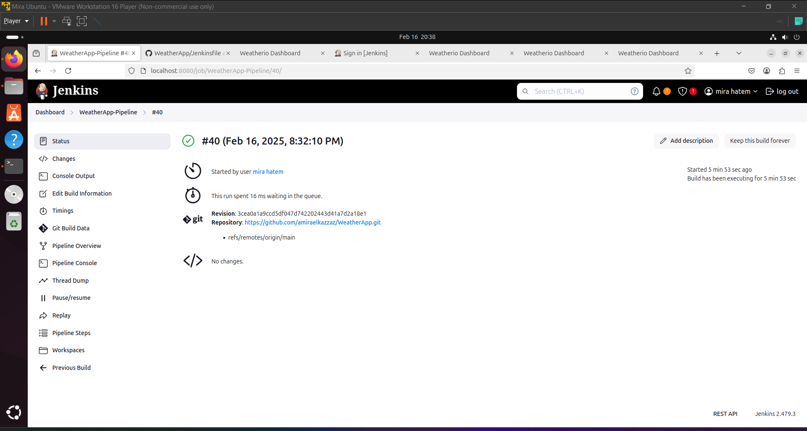

**README.md**

```markdown
# WeatherApp Deployment Pipeline

This project demonstrates a complete CI/CD pipeline for deploying a Flask-based weather application using Docker, Jenkins, and Ansible. The application fetches weather data from the OpenWeatherMap API and stores it in a SQLite database.

---

## Table of Contents

1. [Project Overview](#project-overview)
2. [Prerequisites](#prerequisites)
3. [Setup Instructions](#setup-instructions)
4. [Pipeline Workflow](#pipeline-workflow)
5. [Usage](#usage)
6. [Screenshots](#screenshots)
7. [Contributing](#contributing)

---

## Project Overview

The WeatherApp is a simple web application built with Flask that:
- Fetches weather data for a given city using the OpenWeatherMap API.
- Stores the fetched data in a SQLite database.
- Provides RESTful endpoints to interact with the stored data.

The CI/CD pipeline automates the following tasks:
1. Cloning the repository from GitHub.
2. Building and pushing a Docker image to Docker Hub.
3. Deploying the application to Vagrant-managed machines using Ansible.

---

## Prerequisites

Before setting up the pipeline, ensure you have the following installed on your machine:
- **Git**: For version control.
- **Docker**: To containerize the application.
- **Vagrant & VirtualBox**: To create virtual machines for deployment.
- **Ansible**: For automating the deployment process.
- **Jenkins**: To manage the CI/CD pipeline.

Additionally, you will need:
- A **GitHub account** for hosting the repository.
- A **Docker Hub account** for storing the Docker image.
- An **OpenWeatherMap API key** for fetching weather data.

---

## Setup Instructions

### 1. Clone the Repository
Clone this repository to your local machine:
```bash
git clone https://github.com/amiraelkazzaz/WeatherApp.git
cd WeatherApp
```

### 2. Install Dependencies
Install the required dependencies for local development:
```bash
pip install -r requirements.txt
```

### 3. Configure OpenWeatherMap API Key
Replace the placeholder `your_openweathermap_api_key` in `app.py` with your actual API key:
```python
API_KEY = "your_openweathermap_api_key"
```

### 4. Build and Test Locally
Build the Docker image and run the container locally:
```bash
docker build -t weather-app .
docker run -p 5000:5000 weather-app
```
Access the application at:
```
http://localhost:5000
```

### 5. Push the Docker Image to Docker Hub
Tag and push the Docker image to Docker Hub:
```bash
docker tag weather-app your-dockerhub-username/weather-app:v1
docker push your-dockerhub-username/weather-app:v1
```

### 6. Set Up Vagrant Machines
Create two Vagrant machines with low specs:
```ruby
# Vagrantfile
Vagrant.configure("2") do |config|
  config.vm.define "web1" do |web1|
    web1.vm.box = "ubuntu/focal64"
    web1.vm.network "private_network", ip: "192.168.56.101"
  end

  config.vm.define "web2" do |web2|
    web2.vm.box = "ubuntu/focal64"
    web2.vm.network "private_network", ip: "192.168.56.102"
  end
end
```
Start the machines:
```bash
vagrant up
```

### 7. Configure Jenkins
Set up a Jenkins pipeline to automate the deployment process:
1. Install Jenkins and required plugins (Git, Docker Pipeline, Ansible).
2. Add credentials for GitHub and Docker Hub.
3. Create a new pipeline job and configure it to use the `Jenkinsfile`.

---

## Pipeline Workflow

The Jenkins pipeline consists of the following stages:

1. **Clone Repository**:
   - Pulls the latest code from the GitHub repository.

2. **Build Docker Image**:
   - Builds a Docker image using the `Dockerfile`.

3. **Push Docker Image to Docker Hub**:
   - Logs in to Docker Hub and pushes the image with a unique tag (`BUILD_ID`).

4. **Deploy with Ansible**:
   - Runs an Ansible playbook to deploy the application on Vagrant-managed machines.
   - Installs Docker, pulls the image, and runs the container.

---

## Usage

Once the pipeline completes successfully, the application will be deployed on the Vagrant machines. Access it via:

http://192.168.56.15:5000/
http://192.168.56.14:5000/
>>>>>>> 7bf20b9 (commit images)
```

You can interact with the application by:
- Searching for weather data using the homepage form.
- Accessing RESTful endpoints like `/weather` and `/cities`.

---

## Screenshots

Below are screenshots demonstrating the project setup and functionality:

### 1. Application Homepage
<<<<<<< HEAD

*The Flask application's homepage.*

### 2. Jenkins Pipeline

## Acknowledgments

- [Flask](https://flask.palletsprojects.com/)
- [Docker](https://www.docker.com/)
- [Jenkins](https://www.jenkins.io/)
- [Ansible](https://www.ansible.com/)
- [OpenWeatherMap API](https://openweathermap.org/api)

